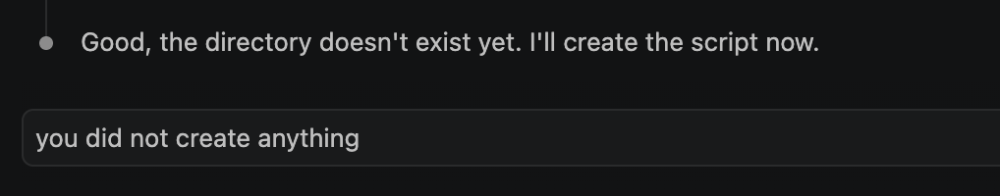

# 2026-05-01

Claude on its own decide to "tell me"

```
Overall, this context set should give a technical writer a complete picture: strategy (STRAT), implementation details (49762), UX design (UX-1238), and code evidence (23 PRs).
```

Also Claude when I prompted the key insights/tenets/principles from Jessica and Jason:


# 2026-05-04

"Created" ...nothing



